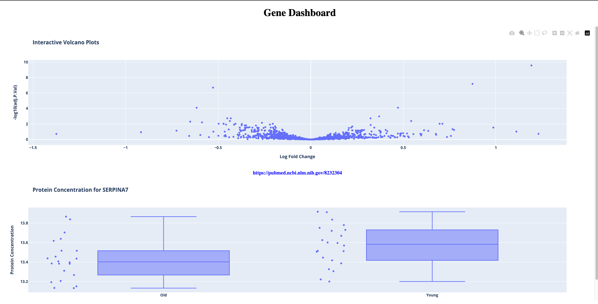

# Gene Dashboard

This project is a web-based dashboard that displays an interactive volcano plot of protein activity differences and a corresponding boxplot that updates when a data point is clicked. It also displays Pubmed article related to the selected gene.

## Screenshot



## Installation

1. **Clone the Repository**:

   ```bash
   git clone https://github.com/awerks/gene.git
   cd gene
   ```

2. **Create a Virtual Environment**:

   ```bash
    python -m venv venv
   ```

3. **Activate the Virtual Environment**:

   - On Windows:
     ```bash
     venv\Scripts\activate
     ```
   - On macOS/Linux:
     ```bash
     source venv/bin/activate
     ```

4. **Install Dependencies**:

   ```bash
   pip install -r requirements.txt
   ```

5. **Run the Flask Server**:

   ```bash
   flask run --debug
   ```

6. **Access the Dashboard**:
   at `localhost:5000` in your web browser
